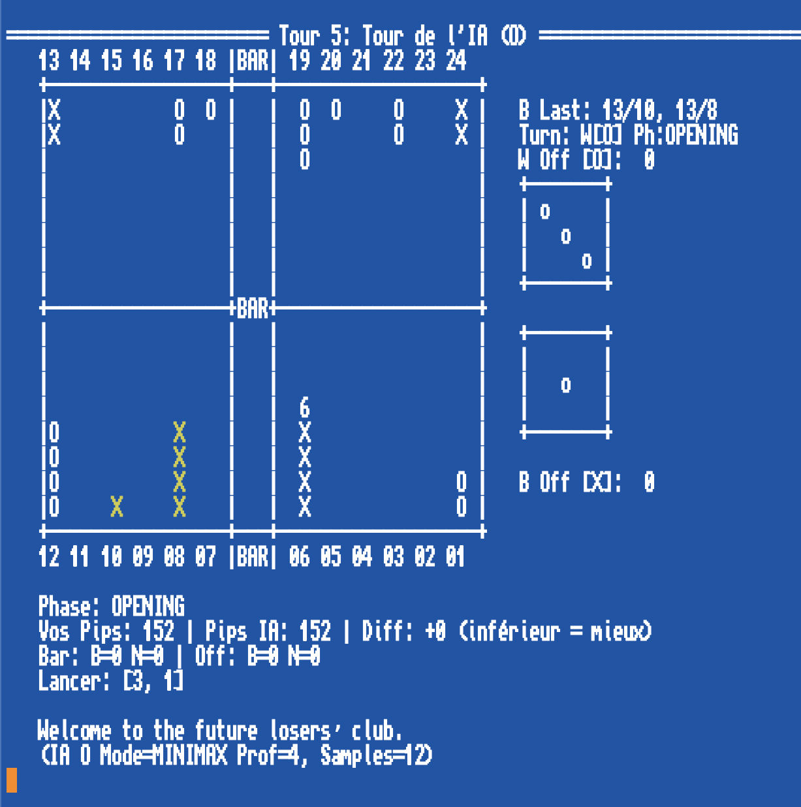

# Python Backgammon AI with Hybrid Minimax/NN

This repository contains a Python implementation of a Backgammon game featuring a command-line interface and an AI opponent. The AI employs a hybrid approach, combining traditional game heuristics with a neural network evaluator within an Expectiminimax search framework.



## Features

*   **Playable Backgammon:** Text-based interface for human vs. AI gameplay.
*   **Hybrid AI:** Combines a fast heuristic evaluation with a deeper understanding from a Neural Network.
*   **Minimax Search:** Uses Expectiminimax to handle the probabilistic nature of dice rolls.
*   **Transposition Table:** Uses Zobrist hashing to cache previously evaluated game states and speed up the search.
*   **Neural Network Integration:** A PyTorch-based NN evaluates board positions, aiding the Minimax search and pruning.
*   **Cython Optimizations:** Critical game logic functions are accelerated using Cython for significantly improved performance.
*   **Configurable AI:** Adjust AI behavior via constants (`AI_MODE`, `MAX_DEPTH`, `NN_WEIGHT`, `NUM_DICE_SAMPLES`).
*   **Training Pipeline:** Scripts are included (`watchdog`, `collect_inf`, parser, trainer) to demonstrate how the NN model was potentially generated using self-play data from `gnubg`.

## How It Works

The AI's decision-making process relies on several components working together:

### 1. Hybrid Evaluation (`evaluate_position_hybrid`)

Instead of relying solely on one evaluation method, the AI blends two scores:

*   **Heuristic Score:** A fast, rule-based evaluation (`evaluate_position_heuristic`) considering factors like pip count difference, blots, points made, anchors, primes, checkers on the bar, and checkers off. Different weight profiles (`OPENING_WEIGHTS`, `MIDGAME_WEIGHTS`, `ENDGAME_WEIGHTS`) are used depending on the game phase.
*   **Neural Network Score:** A deeper, pattern-based evaluation from a trained neural network.

The final score is a weighted average: `score = (1 - NN_WEIGHT) * heuristic_score + NN_WEIGHT * nn_score`. The `NN_WEIGHT` constant (0.0 to 1.0) controls the balance.

### 2. Neural Network Details (`MiniMaxHelperNet`)

*   **Architecture:** A simple feed-forward network implemented in PyTorch (`nn.Module`).
    *   Input Layer: 54 features.
    *   Hidden Layers: 2 fully connected layers with 256 neurons each, using ReLU activation.
    *   Output Layer: 1 neuron producing a single score representing the position's value for the current player.
*   **Input Encoding (`state_to_tensor`):** Game states are converted into a 54-feature tensor for the NN. This encoding **must** match the one used during training.
    *   `0-23`: White checker count on points 1-24 (normalized by `/ 15.0`).
    *   `24-47`: Black checker count on points 1-24 (normalized by `/ 15.0`).
    *   `48`: White checkers on bar (normalized by `/ 15.0`).
    *   `49`: Black checkers on bar (normalized by `/ 15.0`).
    *   `50`: White checkers off (normalized by `/ 15.0`).
    *   `51`: Black checkers off (normalized by `/ 15.0`).
    *   `52`: Current player's turn (1.0 for White, 0.0 for Black).
    *   `53`: Normalized Pip Difference `(pip_black - pip_white) / 100.0`.
*   **Perspective (`_tensor_for_player`):** The input tensor is flipped appropriately when evaluating for the Black player, ensuring the NN always sees the board from its own perspective.
*   **Training Data:** The provided `minimax_helper.pt` model was trained on a dataset of ~100,000 positions generated from self-play games using `gnubg` at various levels. The included scripts (`watchdog`, `collect_inf.py`, SQLite parser, training script) outline the process used to generate this data and train the model.

### 3. Minimax Search (`minimax`)

*   **Algorithm:** Expectiminimax is used to handle the chance element (dice rolls). Max nodes represent the AI's turn, Min nodes (implicitly handled by maximizing the negative score) represent the opponent's turn, and Chance nodes represent the dice rolls.
*   **Chance Node Handling:** Instead of evaluating all 36 possible dice outcomes (which is computationally expensive), the search evaluates a fixed number (`NUM_DICE_SAMPLES`) of randomly sampled dice rolls at each chance node. This is a common optimization that significantly speeds up the search at the cost of some accuracy, as the AI doesn't see the *exact* expected value over all rolls.
*   **Transposition Table (TT):** A dictionary (`TT`) stores the results of previously computed states (`(zobrist_hash, depth, player) -> score`). Zobrist hashing (`compute_zobrist`) provides efficient incremental updates and lookups. This avoids re-calculating scores for identical positions reached through different move sequences.
*   **NN-Assisted Pruning:** The hybrid evaluation function is called at the leaf nodes (`depth == 0`) or when a terminal state is reached. The scores obtained (influenced by the NN) provide better estimates of a position's value earlier in the search. These more accurate scores improve the effectiveness of Alpha-Beta pruning, allowing the search to discard irrelevant branches more quickly. Pruning happens *within* the evaluation of outcomes for a single sampled dice roll.

### 4. Cython Speedups (`speedups.pyx`)

To achieve reasonable performance in Python, several performance-critical functions are implemented in Cython:
*   `calculate_pip`: Pip counting.
*   `get_single_moves_for_die`: Generating legal moves for a single die.
*   `make_move_base_logic`: Applying the core logic of moving a checker.
*   `check_all_pieces_home`: Checking bear-off readiness.
*   `compute_zobrist_cy`: Zobrist hash calculation.

These Cython functions operate directly on NumPy arrays and low-level types, providing a substantial speedup compared to pure Python implementations. **Compiling these is essential for decent AI performance.**

## Dataset and Training

The provided `minimax_helper.pt` neural network model was trained on a dataset generated using the following (conceptual) pipeline:

1.  **Data Generation:** The `gnubg` Backgammon engine was used to generate a large number (e.g., 100,000) of self-play games at various skill levels. Scripts like `watchdog` and `collect_inf.py` (provided) can automate interacting with `gnubg` to collect game data or position evaluations.
2.  **Parsing:** A dedicated Python script parsed the raw `gnubg` game logs or position data.
3.  **Database Creation:** The parsed data (board state, potentially pip counts, turn, and a `gnubg` evaluation score or game outcome) was stored in an SQLite database for efficient access during training.
4.  **Training:** Another Python script loaded data from the SQLite database, converted board states into the 54-feature tensor format, and trained the `MiniMaxHelperNet` model (using PyTorch) to predict the `gnubg` score or game outcome based on the input tensor. The trained model was saved as `minimax_helper.pt`.

*Note: The specific scripts and their exact usage might require examination and potentially adaptation.*

## Setup and Installation

1.  **Prerequisites:**
    *   Python 3.x
    *   Pip (Python package installer)
    *   Git (for cloning the repository)
    *   **A C Compiler:** Cython generates C code which needs to be compiled.
        *   **Linux:** Typically `gcc` (install via package manager, e.g., `sudo apt install build-essential` on Debian/Ubuntu).
        *   **macOS:** Xcode Command Line Tools (install via `xcode-select --install`).
        *   **Windows:** Microsoft C++ Build Tools (available as part of Visual Studio Installer - select "Desktop development with C++").

2.  **Clone the Repository:**
    ```bash
    git clone <repository-url>
    cd <repository-directory>
    ```

3.  **Install Dependencies:**
    *   It's usually recommended to use a virtual environment:
        ```bash
        python -m venv venv
        source venv/bin/activate  # Linux/macOS
        # venv\Scripts\activate    # Windows
        ```
    *   Install required packages (ensure you have `Cython` listed here or install it separately first):
        ```bash
        pip install -r requirements.txt
        # Or manually: pip install numpy torch cython
        ```

4.  **Compile Cython Extension:** This is crucial. You need to run the compilation command from the terminal in the project's root directory:

    ```bash
    python setup.py build_ext --inplace
    ```
    This command compiles `speedups.pyx` into C code and then builds a native extension module (e.g., `speedups.cpython-3X-...so` or `speedups.pyd`) directly in your project folder, allowing Python to import it.

5.  **Get the Neural Network Model:**
    *   Don't forget to download the pre-trained `minimax_helper.pt` file.
    *   Place it in the **root directory** of the project, alongside the main Python script (`BKG_NN.py`).
    *   Alternatively, you can attempt to retrain the model using the provided training pipeline scripts (this will require setting up `gnubg` and potentially significant time...*)

(*) As a reference, the watchdog script along with collect_inf can produce 15 full games in one minutes on a MAC M2. That makes 100 000 games in 4.5 days.

## Running the Game

Once setup is complete, run the main script from your terminal:

```bash
python BKG_NN.py
 ```
Follow the on-screen prompts to choose your color and play the game. 
Enter moves in the format source/destination (e.g., 13/7, bar/5, 24/off).
Have fun!

## Configuration

Several constants at the beginning of BKG_2_05.py can be adjusted:
1. AI_MODE: Set to "MINIMAX" (default) or "NN_ONLY" (uses only NN evaluation, faster but potentially weaker).
2. MAX_DEPTH: Search depth for Minimax (higher = slower, potentially stronger).
3. NN_WEIGHT: Balance between heuristic (0.0) and NN (1.0). Default is 0.5.
4. NUM_DICE_SAMPLES: Number of dice rolls sampled at chance nodes (higher = slower, more accurate expectation).
5. SHOW_STATS: Set to True to enable cProfile output after AI moves (for performance analysis).

 
## Acknowledgments and Credits

This project merges two approaches:

*   The **Minimax search structure with Alpha-Beta pruning and dice sampling** was inspired by and adapted from the java code provided by Llasserre / llaki in the [llaki/BackgammonAI](https://github.com/llaki/BackgammonAI/tree/master) project. Thanks for that clear and effective initial work.
*   The **detailed adaptive heuristic evaluation function** and the **ASCII game interface** originate from a previous personal script (`BKG-21_04.py`).
*   (+) An unvaluable help has been provided by Google AI Studio.

The goal was to leverage the predictive power of Minimax + NN guidance for pruning while benefiting from the nuances of an advanced, dynamic position evaluation.

## License

This project is licensed under the **Creative Commons Attribution-NonCommercial 4.0 International License (CC BY-NC 4.0)**.


